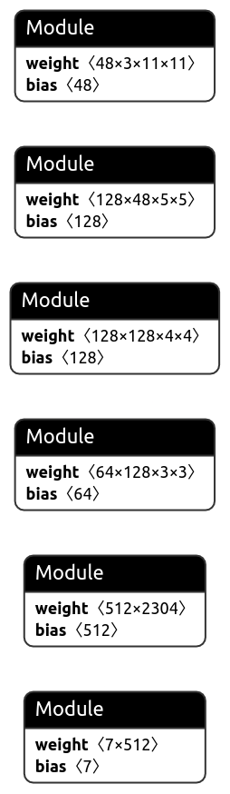

# Mineral-Detection

Deep Learning has shown immense capability in image classification. Here I have used Convolutional Neural Networks to predict the class of Minerals using images. Developed a Flask API to return the results as JSON string format. Click package is used to make a command to provide path to image and get back the results. The API is hosted at https://min-dec.herokuapp.com/.
To have less traffic and storage on servers, Heroku dynos take time after remaining unused for a long time. So, it may take a little while if you use this after a gap of a day or so.  
# Classes
```ruby
0: 'biotite'
1: 'bornite'
2: 'chrysocolla'
3: 'malachite'
4: 'muscovite'
5: 'pyrite'
6: 'quartz'
```
To train the model - `python3 mineral-detection.py`

# Model Architecture
<div align="center">



</div>


# Running the model 

Requirements (Optional for just using the API):
```ruby

torch==1.8.1+cpu
torchvision==0.9.1+cpu
Flask==2.0.1
seaborn==0.11.1
tqdm==4.60.0
matplotlib==3.4.1
requests==2.22.0
numpy==1.20.2
pandas==1.2.4
Pillow==8.3.0
protobuf==3.17.3
scikit_learn==0.24.2
gunicorn

```

Follow these steps:

* Clone the repo
* Run `python3 send.py --path=<PATH-TO-IMAGE>`

Sample output:

```ruby
python3 send.py --path="/home/anshul/data/chrysocolla/0003.jpg"

{'Class_Name': 'chrysocolla'}
```
